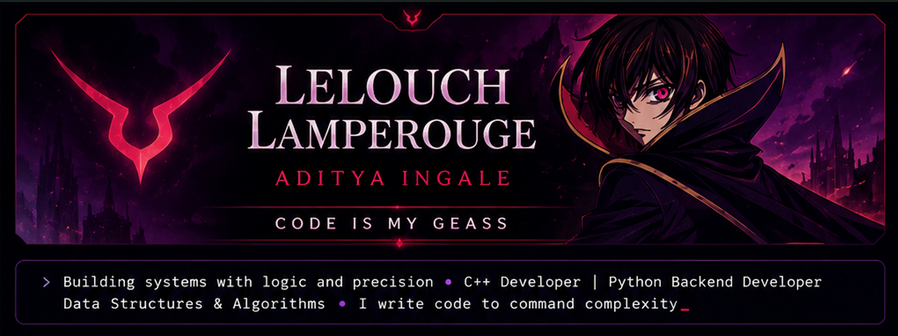

<!-- Banner -->

  

  

  Software Engineer • Competitive Programmer • Chess Enthusiast

---

## ABOUT

<table>
<tr>

<td width="58%" valign="top">

### ♟ Philosophy

Chess has had a huge influence on how I approach software development.

Instead of rushing toward a solution, I prefer to evaluate the position, understand the constraints, and think several moves ahead before committing to an implementation.

The same mindset helps me write software that is deliberate, maintainable, and built with long-term thinking.

> **"If the king doesn't lead, how can he expect his subordinates to follow?"**  
> — *Lelouch vi Britannia*

</td>

</tr>
</table>

 

<table align="center">
<tr>
<td align="center" width="20%">

### 🎯 Focus

I build software with a focus on **clarity, performance, and practical problem-solving**.

Most of my foundation comes from **C++** and **Data Structures & Algorithms**, where I have spent serious time improving how I break down problems, optimize solutions, and think through edge cases.

Currently, I am expanding into **Python backend development**, especially API design, databases, authentication, and full-stack project architecture.

 

<table>
<tr>
<td width="50%">

**Currently Building**

- Mini Redis Cache  
- LeetCode Tracker  
- Python backend projects  

</td>
<td width="50%">

**Core Strengths**

- C++ and DSA  
- Backend logic  
- Clean project structure  

</td>
</tr>
</table>

</td>

**Language**

C++

</td>

<td align="center" width="20%">

**Backend**

Python + FastAPI

</td>

<td align="center" width="20%">

**Problem Solving**

900+ DSA

</td>

<td align="center" width="20%">

**Competitive**

2★ CodeChef

</td>

<td align="center" width="20%">

**Approach**

Strategy • Precision • Execution

</td>

</tr>
</table>

---

## STACK

---

## STATS

  

---

## PROJECTS

<table>
<tr>

<td width="50%" valign="top">

### ⚡ Mini Redis Cache

**Tech Stack**

`C++` • `CMake` • `Multithreading` • `TCP`

A lightweight Redis-inspired in-memory key-value database supporting **LRU eviction**, **TTL expiration**, **disk persistence**, and a custom **TCP server** built from scratch.

🔗 **Repository:** [GitHub](https://github.com/Lelouch-Lamperouge2004/MiniRedis)

</td>

<td width="50%" valign="top">

### 📊 LeetCode Progress Tracker

**Tech Stack**

`FastAPI` • `React` • `SQLAlchemy` • `SQLite`

Full-stack application for tracking coding progress, managing solved problems, authentication, and visualizing DSA consistency.

🔗 **Live Demo:** [Open App](https://leetcode-progress-tracker-zeta.vercel.app/)

🔗 **Repository:** [GitHub](https://github.com/Lelouch-Lamperouge2004/LeetCode-Progress-Tracker)

</td>

</tr>

<tr>

<td width="50%" valign="top">

### 🎥 CVD GAN Video Optimization

**Tech Stack**

`Python` • `PyTorch` • `OpenCV` • `Conditional GAN`

Deep learning system that enhances videos for people with color vision deficiency through intelligent frame-by-frame color transformation.

🔗 **Repository:** [GitHub](https://github.com/Lelouch-Lamperouge2004/CVD-Video-Color-Optimization)

</td>

<td width="50%" valign="top">

### 💬 Sentiment Analysis Web App

**Tech Stack**

`Python` • `Streamlit` • `Scikit-learn` • `NLP`

Interactive web application that classifies reviews into **Positive** and **Negative** sentiment with preprocessing, visualization, and real-time prediction.

🔗 **Live Demo:** [Open App](https://sentiment-analysis-systembranchmainmainfilepathapppy-f27bvgvzx.streamlit.app/)

🔗 **Repository:** [GitHub](https://github.com/Lelouch-Lamperouge2004/Sentiment-Analysis-Streamlit)

</td>

</tr>
</table>

---

## ACTIVITY

---

## CONTRIBUTION MAP

---

## CONTACT

